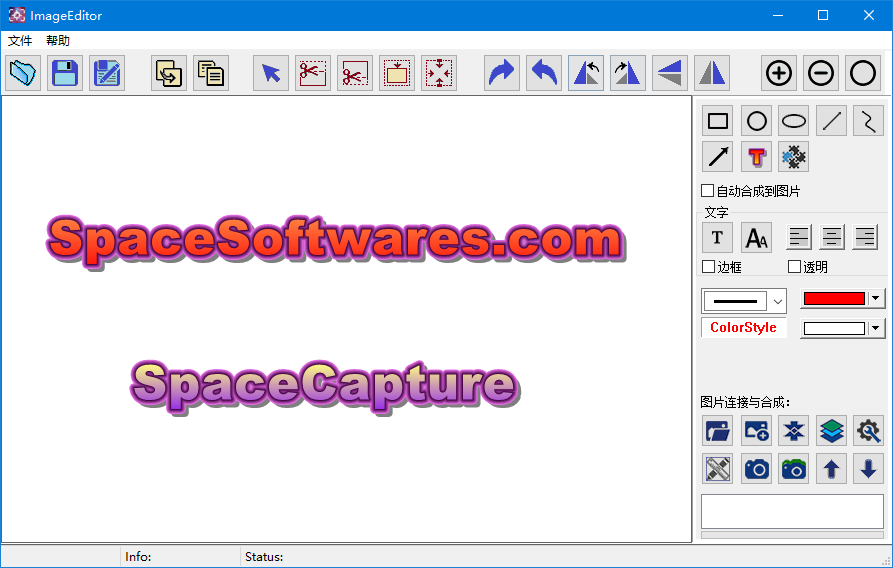
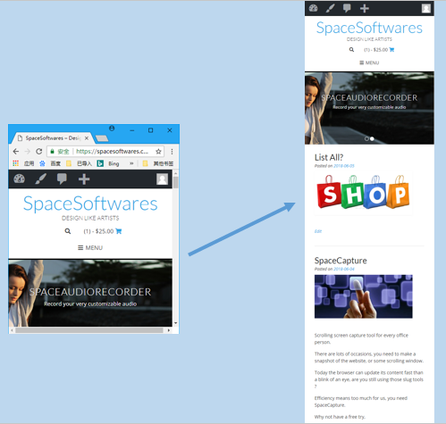
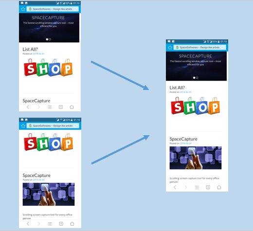
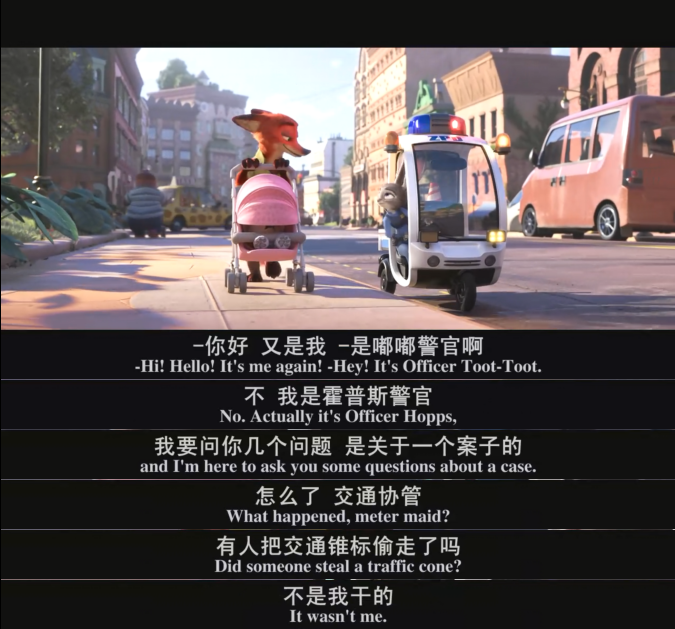

# Collection of Software Tools in Windows by SpaceSoftwares.com

These software tools are also available at SpaceSoftwares.com, but that website cost me lots of money and I was unable to maintain it now! Thus I backuped all tools here!

All tools are free, without any advertisements or info collect function. You even don't need to install or uninstall. Extract to your disk then you can use it. Delete it at any moment if you don't like.

## SpaceCapture

Are you still using those slug tools ? It is time for a change.

SpaceCapture provides the fastest Scrolling Screen snapshotting capability for your office work.

Amazingly small,  fast scrolling snapshots, convenient and splendid image editor…

#### QuickView

Main Tools view

 

Image editor

1.Capture as fast as your browser can refresh

2.Concatenate pictures with easy

3.Get your video frames and attached captions without any edit work

4.Capture any shape

#### A short introduction

Detailed introduction in Chinese:

<https://blog.csdn.net/tanmx219/article/details/80669552>

SpaceCapture is one of the quickest multifunctional scrolling screenshotting tools, with convenient and splendid image editor, to facilitate your office work.

It provides additional video frame capture and image concatenation functions. Green, speedy, quick. and amazingly small, less than 2M.

(1)  If you use some other desktop snapshotting tools, general they will present you with a fake precaptured desktop image and let your make selection in that image. That explains why the movie or animation image stops when you start their capture function; but, SpaceCapture uses a totally different transparancy technique, so that everything you see is the real time desktop (NOT a fake precaptured image), and the animation images or movie will play on under the transparent capturing window, thus you can enjoy the real time snapshotting!!!

(2) extremely fast and convenient, it provides 3 manners of capturing modes, you can select any one match your preference. e.g., you can get the area cut clean when it finishes the capture, that means you don't need to do any extra editing work such as cutting and resizing. 

(3) easy and convenient in video frame capture. You can capture any video frame, and attach the relevant captions just below or above the frame to make movie stories, as you can see from most of movie post blogs. This is a world of we-media, and you need to publish stories, right? 

(4) image concatenation functions. You can concatenate your images, e.g. multi-images from mobilephone screen shots, to make an elongated one, that is also what we do to make a long story. 

(5) minimized resource consumption. We are doing our best to minimize the resource consumption. The software is amzingly samll, less than 2 disk Megabytes; green, you don't need to worry about installation and uninstallation. Just a simple click, that's all it takes. And it is written in pure C combined with windows native api's, no dependence on any other resources. clear and clean. 

(6) convenient image editor function. in addition to various shape drawing, you can have art text or general text as you like with easy. For elongated pictures, cutting and editing has never been so convenient as today.

 

## SpaceView

A convient tool for image viewing....

A Free image viewer under windows,

Are you still using a 100M image viewer to see a 5M image? That’s a bad idea, especially when you are a designer and have lots of program running…

We are doing our best to minimize the resource consumption, and as fast as the operation system can provide, and, hope it can be as convenient as you expected!

If you are a designer, e.g, if you have lots of elongated pictures, designs, or scroll snapshots, that is it!

Just try it, as simple as you can feel and see.

## SpaceAudioRecorder

Sometimes you may need to record a small section of good music from the website, since it is so beautiful and rare.

SpaceAudioRecorder is the fit for you, simple and easy, just one click.

It can record microphone or speaker voice for your system.

It supports MP3, AAC and wave formats.

## SpaceRecorder (video recorder)

Just a simple and easy screen/movie recorder, you can record web-net movie when watching, or record your desktop activities into mp4.

## Unicode2ChineseConverter

A simple tool for translate Unicode to Chinese, so simple, so easy!

